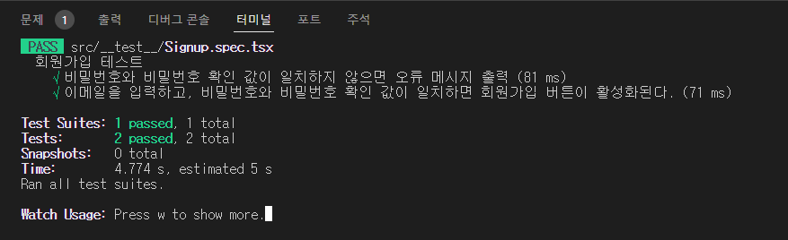
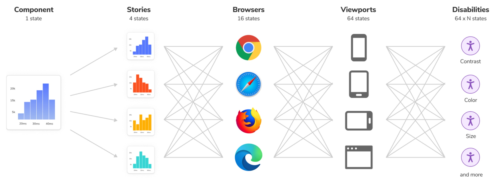

# 프론트엔드 테스트 기본기 👍


## 강의
[2시간으로 끝내는 프론트엔드 테스트 기본기](https://www.inflearn.com/course/%EC%A3%BC%EB%8B%88%EC%96%B4-%ED%94%84%EB%A1%A0%ED%8A%B8%EC%97%94%EB%93%9C-%ED%85%8C%EC%8A%A4%ED%8A%B8-%EA%B8%B0%EB%B3%B8%EA%B8%B0/dashboard)


## 하는 이유
- 네부캠 챌린지하면서 테스트코드 작성하는 방법에 대해서 배웠는데 생각했던 것보다 복잡하고 어려운 세계 같아서 공부해야겠다고 생각
- 기본 자바스크립트 테스트 뿐 아니라 리액트에서 테스트코드를 적용하는 법에 대해서 배워야겠다고 생각
- 짧아서 좋다

# 공부

## 테스트의 목적
1. 정확성과 신뢰성을 확보하기 위해 수행
  
코드가 올바르게 작동하는지 확인하고 예상대로 동작하는지를 확인하려고 하는 것

2. 수월한 리팩토링

프로젝트 규모가 커지면 리팩토링을 할 수 밖에 없다. (코드 품질, 성능 등)

이때 테스트 코드가 있다면 리팩토링시 달성해야하는 최소한의 조건이 생겨서 수월하게 할 수 있다. 변경사항이나 최적화가 예상치 못한 버그를 만들지 않을 수 있게 할 수 있다.

프로젝트 초반부터 테스트코드를 쓰기에는 시간이 부족할 수 있다. 그래서 리팩토링 전에 테스트 코드를 작성하는 것을 추천한다. 리팩토링 전 테스트코드로 안전망을 둘러두는 것

> 동아리 페이지 만드는 프로젝트할 때 느낌

3. 문서화에 용이
직접적인 목적은 아니지만 테스트케이스를 하나의 코드에 모아두다보니 한 눈에 보기 편하고 요구사항을 빠뜨린게 있는지 등을 확인하기 쉽다.

4. 인수인계 용이
직접 코드를 작성한 사람이 아니더라도 테스트코드가 있으면 인수인계하기 쉽다. (이해가 빨라서)

## 프론트엔드 테스트에서는 무엇을 해야할까
- 비즈니스 로직 테스트
- 로그인 성공 실패 테스트
- 컴포넌트가 잘 동작되는지
  
## 테스트 종류
유닛테스트 - 가장 작은 단위 테스트, 하나의 동작을 확인하고 독립적
통합테스트 - 유닛테스트 하나로 묶여서 잘 작동하는지, 상호작용이 잘되는지 등
E2E 테스트 - 엔드투엔드 테스트, 사용자들이 실제로 사용하는 것처럼 테스트

---

## 회원가입 테스트


### 트러블 슈팅

```bash
FAIL  src/__test__/Signup.spec.tsx
● Test suite failed to run

  Jest encountered an unexpected token

  Jest failed to parse a file. This happens e.g. when your code or its dependencies use non-standard JavaScript syntax, or when Jest is not configured to support such syntax.
```
처음 리액트 테스트코드 작성하자마자 만난 에러, CSS 파일을 읽지 못해서 생기는 오류

해결방법: 루트 폴더에 `__mocks__` 폴더 생성하고 styleMock.cjs 빈 파일을 만들고, jest.config.cjs에 아래 코드 추가로 해결
```js
moduleNameMapper: {
  "\\.(css|less)$": "<rootDir>/__mocks__/styleMock.cjs",
},
```

읽으려다가 오류나는 CSS 파일 대신 Mock된 styleMock을 읽도록 해서 넘기는 방법이다.

## 스토리북
- UI 컴포넌트를 독립적으로 개발하고 문서화할 수 있는 환경을 제공하는 도구.
- UI 컴포넌트에 `story` 를 부여해서 렌더링을 테스트하는 것
- 여기서 `story`는 UI 컴포넌트의 `상태 (state)`
    - `<button>` 을 예로 들면.
    - `disabled`, `enabled`, `primary`, `secondary` 등등
  

- 스토리북은 디자인 시스템을 구축하고 유지하는 데 있어 중요한 역할을 함.
    - 개발한 컴포넌트가 디자인 가이드에 맞는지
    - 컴포넌트의 레이아웃, 색상, 타이포그래피 등 다양한 디자인 요소를 일관성 있게 관리 가능.
    - 디자인 토큰, 컴포넌트, 패턴 등을 문서화하며, 팀 내에서 공유 및 재사용 용이.
- 팀원들 간의 커뮤니케이션을 강화하며, 디자인과 코드를 일관성 있게 유지할 수 있게 도와줌.
    - 프론트엔드 개발자들 간 소통이 수월해짐
    - 디자이너와 협업이 수월해짐